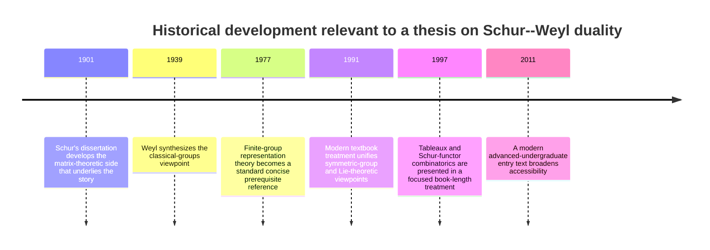

# Undergraduate Thesis Blueprint for Schur–Weyl Duality

## Executive Summary

The two uploaded notes suggest a very clear and workable undergraduate thesis strategy: make the **classical Schur–Weyl decomposition of \(V^{\otimes k}\)** the center of the project, build up to it through **Young diagrams, Young symmetrizers, and Specht modules**, and then end with **worked examples** and, only if time and background allow, an **optional final chapter on Schur polynomials and highest weights for \(\mathfrak{sl}_n\)**. One source is strongest on finite-group preliminaries, Specht modules, the double-centralizer theorem, and optional variants; the other is strongest on Schur functors, character calculations, and the highest-weight interpretation. That makes a combined thesis more convincing if it has one proof spine rather than several parallel narratives. fileciteturn0file0 fileciteturn0file1

For an undergraduate audience, the cleanest notation is to let \(n=\dim V\) and \(k\) be the tensor-power degree, to write \(S^\lambda\) for the irreducible \(S_k\)-module and \(\mathbb S_\lambda(V)\) for the Schur functor, and to reserve Lie-theoretic refinements for the end. That choice avoids the notation clash between the two notes and also aligns with the standard modern pedagogical arc in the most widely used references: finite groups and \(S_d\), then Weyl’s construction, then Lie-theoretic refinements. The standard modern backbone text organizes the material in exactly that order, while the AMS introductory text is explicitly aimed at advanced undergraduates and beginning graduate students, and Hall’s Lie-theory text is designed to be elementary while still rigorous. citeturn8view2turn5view0turn4view1

A practical target is **35–45 pages of main text** plus bibliography and one optional appendix. That is long enough to include definitions, a serious main theorem, several nontrivial examples, and a modest exercise set, but short enough that the thesis remains expository rather than becoming a compressed monograph.

## Synthesis of the Two Source Documents

The main issues between the two notes are not mathematical contradictions; they are mostly **notation and presentation conflicts**. The table below records the ones worth normalizing before you start writing.

| Issue | Source note A | Source note B | Recommended thesis convention |
|---|---|---|---|
| Tensor-power index | uses \(V^{\otimes d}\) | uses \(V^{\otimes n}\) | use \(V^{\otimes k}\) |
| Dimension of \(V\) | uses \(n=\dim V\) | uses \(d=\dim V\) | use \(n=\dim V\) |
| Symmetric group | \(S_d\) | \(S_n\) | use \(S_k\) |
| Irreducible \(S_k\)-module attached to \(\lambda\) | \(V_\lambda\) from \(C[S_k]c_\lambda\) | \(V_\lambda\) from Specht modules | use \(S^\lambda\) |
| Schur functor notation | \(S_\lambda(V)\) | \(S_\lambda V\) | use \(\mathbb S_\lambda(V)\) |
| Main route to the theorem | Young symmetrizers \(\to\) Schur functors \(\to\) characters/highest weights | finite-group preliminaries \(\to\) Specht modules \(\to\) double centralizer | combine both, but make the double-centralizer route the main proof spine |
| Lie-theoretic endpoint | \(\mathfrak{sl}_n\) highest weights | mostly \(GL(V)\), \(U(\mathfrak{gl}(V))\), duality variants | treat \(\mathfrak{sl}_n\) as optional final chapter |

The most important clash is the reversal of the roles of \(n\) and \(d\): one note uses \(d\) for tensor degree and \(n\) for dimension, while the other does the reverse. A second, subtler clash is that one note passes through right ideals \(C[S_k]c_\lambda\) and later reconciles left/right actions carefully, while the other presents the symmetric-group module more directly as a left module. For a thesis written for undergraduates, it is cleaner to **fix left \(GL(V)\)-actions and right \(S_k\)-actions on \(V^{\otimes k}\)**, but to define the irreducible symmetric-group module as a left Specht module \(S^\lambda\), and then identify
\[
\mathbb S_\lambda(V)\cong V^{\otimes k}\otimes_{\mathbb C[S_k]} S^\lambda
\]
or equivalently
\[
\mathbb S_\lambda(V)\cong \operatorname{Hom}_{S_k}(S^\lambda,V^{\otimes k}).
\]
That removes the notational friction while preserving the mathematics emphasized in both notes. fileciteturn0file0 fileciteturn0file1

The same synthesis suggests a sharp scope decision. Keep **finite-group character theory, Specht modules, commuting actions, and the Schur–Weyl theorem** in the main body. Move **RSK, Brauer/partition-algebra variants, and the full highest-weight endpoint** into an appendix or outlook section unless your advisor explicitly wants a more combinatorial or Lie-theoretic thesis. That recommendation is exactly what the division of emphasis in the two notes points toward. fileciteturn0file0 fileciteturn0file1

## Recommended Thesis Architecture

The architecture below is designed to keep the thesis rigorous without making it top-heavy. It follows the source notes closely in topic coverage, but trims away the most technical branches from the main body. It also matches the standard modern textbook path from symmetric-group representations to Weyl’s construction, with Lie-theoretic material placed later rather than earlier. fileciteturn0file0 fileciteturn0file1 citeturn8view2turn4view1

| Category | Recommended content |
|---|---|
| Learning objectives | Explain the commuting \(GL(V)\)- and \(S_k\)-actions on \(V^{\otimes k}\); define partitions, Young diagrams, tableaux, and Young symmetrizers; describe Specht modules and their role in classifying irreducible \(S_k\)-representations; state and prove a usable double-centralizer theorem; derive the Schur–Weyl decomposition; compute decompositions in small degrees; optionally connect \(\mathbb S_\lambda(V)\) with Schur polynomials and highest weights. |
| Essential prerequisites | Linear algebra through eigenvalues, tensor products, dual spaces, and multilinear maps; basic group theory; the definition of a group representation; quotient spaces and direct sums. |
| Helpful but not strictly necessary prerequisites | Character theory of finite groups; group algebras; the statement of Maschke’s theorem and Schur’s lemma. |
| Optional advanced prerequisites | Basic Lie algebras, Cartan subalgebras, weights, and roots; symmetric functions. |
| Notation conventions | \(n=\dim V\), \(k=\) tensor degree, \(\lambda\vdash k\), \(\ell(\lambda)=\) number of nonzero parts, \(S^\lambda=\) irreducible \(S_k\)-module, \(\mathbb S_\lambda(V)=\) Schur functor, \(GL(V)\) for the general linear group, \(\mathfrak{gl}(V)\) and \(\mathfrak{sl}_n(\mathbb C)\) only when needed. |
| Diagram convention | Use English Young-diagram notation. State once whether the symmetric group acts on the right or on the left; if you choose a left action, use the inverse-permutation convention so the action law is transparent. |

A thesis in the following range is realistic and well balanced.

| Section | Purpose | Estimated pages | Estimated words | Proof policy |
|---|---|---:|---:|---|
| Introduction | motivation, main theorem in words, structure of thesis | 3–4 | 800–1000 | no heavy proofs |
| Background on representations | Maschke, Schur, characters, group algebra | 5–6 | 1200–1500 | prove concise essentials; quote deeper facts if needed |
| Partitions and Specht modules | Young diagrams, tableaux, symmetrizers, irreducibles of \(S_k\) | 6–7 | 1500–1800 | define carefully; sketch classification proof if necessary |
| Tensor powers and commuting actions | define the two actions on \(V^{\otimes k}\), prove they commute | 4–5 | 900–1200 | prove fully |
| Double centralizer and Schur–Weyl | abstract theorem, specialization, main decomposition | 6–8 | 1600–2100 | prove fully |
| Examples and low-degree decompositions | \(k=2,3,4\), vanishing for \(\ell(\lambda)>n\), dimensions | 5–6 | 1200–1500 | prove computations fully |
| Optional advanced chapter | Schur polynomials, character formula, highest weights | 4–5 | 1000–1300 | state clearly; proof sketch acceptable |
| Conclusion and outlook | summary, optional variants and further directions | 1–2 | 300–500 | no proof |

That yields a main text of roughly **34–43 pages** and **7,500–10,900 words**, not counting bibliography and appendices.

Two comparison tables help keep the conceptual architecture visible.

| Symmetric-group side | General-linear side | Bridge in Schur–Weyl duality |
|---|---|---|
| partition \(\lambda\vdash k\) | partition \(\lambda\) with \(\ell(\lambda)\le n\) | the same \(\lambda\) indexes both sides |
| Specht module \(S^\lambda\) | Schur functor \(\mathbb S_\lambda(V)\) | \(V^{\otimes k}\cong \bigoplus_{\lambda} S^\lambda\otimes \mathbb S_\lambda(V)\) |
| hook-length formula for \(\dim S^\lambda\) | Schur/Weyl dimension formulas for \(\dim \mathbb S_\lambda(V)\) | dimensions reconcile inside \(n^k=\dim V^{\otimes k}\) |
| irreducible characters of \(S_k\) | Schur polynomials / polynomial characters of \(GL(V)\) | compare traces of commuting operators on \(V^{\otimes k}\) |
| every partition of \(k\) gives an \(S_k\)-module | \(\mathbb S_\lambda(V)=0\) if \(\ell(\lambda)>n\) | dimension of \(V\) cuts off which \(\lambda\) survive |

| Double-commutant layer | Statement to use | Best placement in thesis |
|---|---|---|
| Abstract semisimple-algebra form | If \(A\subseteq \operatorname{End}(W)\) is semisimple and \(B=\operatorname{End}_A(W)\), then \(B\) is semisimple, \(A=\operatorname{End}_B(W)\), and \(W\) decomposes as \(\bigoplus_i U_i\otimes M_i\) | short theorem in the main text, or appendix if you want a more expository tone |
| Schur–Weyl specialization | In \(\operatorname{End}(V^{\otimes k})\), the image of \(\mathbb C[S_k]\) and the span/image of \(GL(V)\) are mutual centralizers | main theorem section |
| Consequence for decomposition | multiplicity spaces for one side are irreducible modules for the other side | immediately after the specialization |
| Pedagogical decision | prove the general theorem once, then specialize | avoids repeated ad hoc arguments |

The content of these comparison tables is exactly the meeting point of the two uploaded notes: one stresses the finite-group/Specht-module side and the double centralizer, while the other stresses the Schur-functor, character, and highest-weight side. fileciteturn0file0 fileciteturn0file1

## Detailed LaTeX Outline

The following outline is written to be directly reusable. It includes sectioning, theorem placement, example placement, exercises, and bibliography hooks. It is intentionally conservative: it proves the core theorem fully, keeps the most technical representation-theoretic classification results in “state + sketch” form unless your advisor prefers otherwise, and leaves advanced character/highest-weight material optional. That balance is the most undergraduate-friendly way to combine the two source notes with standard textbook usage. fileciteturn0file0 fileciteturn0file1 citeturn8view2turn5view0turn4view1

```latex
\documentclass[12pt]{article}

\usepackage[a4paper,margin=1in]{geometry}
\usepackage{amsmath,amssymb,amsthm,mathtools,mathrsfs}
\usepackage{tikz-cd}
\usepackage{enumitem}
\usepackage{hyperref}
\usepackage{bm}

\title{An Introduction to Schur--Weyl Duality}
\author{Your Name}
\date{\today}

\newtheorem{theorem}{Theorem}[section]
\newtheorem{proposition}[theorem]{Proposition}
\newtheorem{lemma}[theorem]{Lemma}
\newtheorem{corollary}[theorem]{Corollary}

\theoremstyle{definition}
\newtheorem{definition}[theorem]{Definition}
\newtheorem{example}[theorem]{Example}
\newtheorem{exercise}[theorem]{Exercise}
\newtheorem{remark}[theorem]{Remark}

\begin{document}
\maketitle
\tableofcontents

\section{Introduction} % 3--4 pages, 800--1000 words
\subsection{Motivation}
% Explain why tensor powers of a vector space carry two natural symmetries.
% Give a one-paragraph preview of the main decomposition.

\subsection{Main theorem in informal form}
% State the Schur--Weyl decomposition informally before building machinery.

\subsection{Learning objectives and roadmap}
% Explicitly list what the thesis will prove, what it will illustrate, and
% which advanced topics are optional.

\subsection{Notation and conventions}
% Fix n = dim V, k = tensor degree, lambda \vdash k, \ell(\lambda), S^\lambda,
% \mathbb{S}_\lambda(V), right action of S_k on V^{\otimes k}.
% Mention once that other sources swap n and k/d.

\section{Background on representations} % 5--6 pages, 1200--1500 words
\subsection{Representations of finite groups}
% Definitions: representation, irreducible, invariant subspace.

\subsection{Maschke's theorem and Schur's lemma}
% Prove both, but keep proofs concise and self-contained.

\subsection{Characters and the group algebra}
% Enough character theory to motivate multiplicities and semisimplicity.
% Optional: one short proposition on the regular representation.

\subsection{Tensor products and commuting actions}
% Brief background on tensor products and permutation of tensor factors.
% Example:
%   V^{\otimes 2} and the swap map.

% Exercises:
%   E1 (easy): Verify that the action of S_2 on V^{\otimes 2} preserves
%   Sym^2(V) and \Lambda^2(V).
%   E2 (medium): Compute the character of the permutation representation of S_3.

\section{Partitions, tableaux, and Specht modules} % 6--7 pages, 1500--1800 words
\subsection{Partitions and Young diagrams}
% Define partitions, length, conjugate partition, English notation.
% Give several pictures for partitions of 3 and 4.

\subsection{Tableaux and Young symmetrizers}
% Define row group, column group, a_\lambda, b_\lambda, c_\lambda.

\subsection{Specht modules}
% Define S^\lambda as the image of c_\lambda (or the corresponding left ideal).
% State classification theorem:
%   irreducible S_k-modules are indexed by partitions of k.
% Proof policy:
%   give a proof sketch or cite a standard reference if a full proof is too long.

\subsection{Dimension formulas and small examples}
% State the hook-length formula.
% Work out S_3 completely and at least one S_4 example.
% Recommended example:
%   partitions (3), (2,1), (1,1,1) for S_3.

% Exercises:
%   E3 (easy): Compute dimensions of Specht modules for S_4 using the hook-length formula.
%   E4 (medium): Write down c_{(2,1)} explicitly and compute its action on C[S_3].

\section{Tensor powers and the Schur functor} % 4--5 pages, 900--1200 words
\subsection{The two actions on V^{\otimes k}}
% Define:
%   g \cdot (v_1 \otimes \cdots \otimes v_k)
%   (v_1 \otimes \cdots \otimes v_k)\cdot \sigma
% Prove the actions commute.

\subsection{Definition of the Schur functor}
% Define \mathbb{S}_\lambda(V) := V^{\otimes k}\otimes_{\mathbb{C}[S_k]} S^\lambda.
% Also mention equivalent descriptions:
%   \operatorname{Hom}_{S_k}(S^\lambda, V^{\otimes k})
%   and image of the Young symmetrizer on V^{\otimes k}.

\subsection{Basic properties}
% Show \mathbb{S}_{(k)}(V) \cong \operatorname{Sym}^k(V),
% \mathbb{S}_{(1^k)}(V) \cong \Lambda^k(V),
% and \mathbb{S}_\lambda(V)=0 when \ell(\lambda)>n.

% Exercises:
%   E5 (medium): Prove \mathbb{S}_{(k)}(V) \cong \operatorname{Sym}^k(V).
%   E6 (medium): Prove \mathbb{S}_{(1^k)}(V) \cong \Lambda^k(V).
%   E7 (medium-hard): Show \mathbb{S}_\lambda(V)=0 when \ell(\lambda)>n.

\section{Schur--Weyl duality} % 6--8 pages, 1600--2100 words
\subsection{A double-centralizer theorem}
% State the theorem in a finite-dimensional semisimple-algebra form.
% If desired, prove a streamlined version sufficient for this thesis.

\subsection{The centralizer picture inside End(V^{\otimes k})}
% Show the S_k-action and the GL(V)-action commute.
% State that the corresponding images/spans are mutual centralizers.

\subsection{Main theorem}
\begin{theorem}
For a complex vector space V of dimension n and an integer k \ge 0,
\[
V^{\otimes k} \cong \bigoplus_{\lambda \vdash k,\ \ell(\lambda)\le n}
S^\lambda \otimes \mathbb{S}_\lambda(V)
\]
as an S_k \times GL(V)-module.
\end{theorem}

\subsection{Proof of the main theorem}
% This is the proof that should be given in full.
% Suggested steps:
%   1. semisimplicity of \mathbb{C}[S_k],
%   2. double centralizer theorem,
%   3. identify multiplicity spaces with Schur functors,
%   4. explain the length restriction \ell(\lambda)\le n.

\subsection{Immediate consequences}
% Irreducibility of \mathbb{S}_\lambda(V) for \ell(\lambda)\le n.
% Multiplicity interpretation.
% Explicit decompositions for low k.

\section{Examples and computations} % 5--6 pages, 1200--1500 words
\subsection{Degree two}
% Prove:
%   V^{\otimes 2} \cong \operatorname{Sym}^2(V)\oplus \Lambda^2(V).

\subsection{Degree three}
% Prove:
%   V^{\otimes 3} \cong \operatorname{Sym}^3(V)\oplus
%   \mathbb{S}_{(2,1)}(V)^{\oplus 2}\oplus \Lambda^3(V)
% for n \ge 3.

\subsection{Dimension checks}
% Compare:
%   n^k = \sum_{\lambda \vdash k,\ \ell(\lambda)\le n}
%   (\dim S^\lambda)(\dim \mathbb{S}_\lambda(V)).
% Do at least one fully numerical example, e.g. n=2, k=3 or n=3, k=3.

\subsection{A worked example with a specific partition}
% Example: \lambda=(2,1), or \lambda=(3,1), depending on thesis length.

% Exercises:
%   E8 (easy): Decompose V^{\otimes 2} explicitly.
%   E9 (medium): Verify the degree-three decomposition by a dimension count.
%   E10 (medium-hard): Compute \dim \mathbb{S}_{(2,1)}(\mathbb{C}^n).

\section{Optional advanced chapter on characters and highest weights} % 4--5 pages, 1000--1300 words
\subsection{Schur polynomials}
% Define monomial symmetric polynomials and Schur polynomials.
% Keep this section motivational and computational.

\subsection{Character of \mathbb{S}_\lambda(V)}
% State:
%   \chi_{\mathbb{S}_\lambda(V)}(g) = s_\lambda(\mu_1,\dots,\mu_n)
% where \mu_i are the eigenvalues of g.
% Proof policy:
%   give a sketch unless the thesis is intentionally more advanced.

\subsection{Highest weights for \mathfrak{sl}_n(\mathbb{C})}
% State that \mathbb{S}_\lambda(\mathbb{C}^n) has highest weight \lambda.
% Include only the amount of Lie theory needed to make the statement meaningful.

% Exercises:
%   E11 (hard): Identify the highest weight of \mathbb{S}_{(2,1)}(\mathbb{C}^3).
%   E12 (hard): Compare the Schur-polynomial character with a low-dimensional example.

\section{Conclusion} % 1--2 pages, 300--500 words
\subsection{What the theorem explains}
% Summarize the relation between S_k and GL(V).

\subsection{What was omitted}
% Mention RSK, Brauer algebras, orthogonal/symplectic analogues,
% and full highest-weight theory as natural extensions.

\appendix
\section{Optional appendix on RSK or further variants}
% Include only if desired.
% Good use: a brief expository appendix, not a second main thesis.

\bibliographystyle{amsalpha}
\bibliography{schur_weyl}
\end{document}
```

The critical editorial choice in that outline is the proof policy: prove the commuting actions, the double-centralizer theorem in a usable form, and the main Schur–Weyl decomposition fully; state or sketch the classification of Specht modules, hook-length formula, and character/highest-weight refinements unless your supervisor wants a more advanced project. That is the best clarity-to-rigor tradeoff for an undergraduate thesis. fileciteturn0file0 fileciteturn0file1

## Diagrams and Timeline

A short thesis benefits from one diagram that the reader can keep mentally in view throughout the argument. The first code block below is the most useful one: it displays the commuting actions that make Schur–Weyl duality possible. The second block is a compact historical timeline you can either include in the introduction or adapt into a short appendix. The historical markers are anchored in Schur’s 1901 dissertation, Weyl’s classical-groups synthesis, and the later standard expository textbooks. fileciteturn0file0 fileciteturn0file1 citeturn4view5turn0search9turn8view0turn9view0turn5view0

```latex
% Add to preamble:
% \usepackage{tikz-cd}

\[
\begin{tikzcd}[column sep=huge,row sep=huge]
V^{\otimes k}
  \arrow[r, "{\text{right action of }S_k}"]
  \arrow[d, "{\text{left action of }GL(V)}"']
&
V^{\otimes k}
  \arrow[d, "{\text{left action of }GL(V)}"]
\\
V^{\otimes k}
  \arrow[r, "{\text{right action of }S_k}"']
&
V^{\otimes k}
\end{tikzcd}
\]

\[
\text{Hence } \rho(GL(V)) \subseteq \operatorname{End}_{\mathbb C[S_k]}(V^{\otimes k}),
\qquad
\sigma(\mathbb C[S_k]) \subseteq \operatorname{End}_{GL(V)}(V^{\otimes k}),
\]
and Schur--Weyl duality identifies these two centralizers.
```



If you want one more visual element, a small Young-diagram figure for \(\lambda=(3,1)\) or \((2,1)\) is worth adding near the section on tableaux, but the commuting-action diagram above is the single most valuable figure for the whole thesis.

## Reading List, Exercises, and BibTeX Template

The most effective reading order is: first read one short uploaded note end-to-end for the big picture; then read the standard textbook chapters that match your thesis spine; then use focused references only where the thesis needs them. For the core literature, the modern backbone is entity["book","Representation Theory: A First Course","fulton harris"], the combinatorial companion is entity["book","Young Tableaux","fulton 1997"], the most accessible bridge text is entity["book","Introduction to Representation Theory","etingof 2011"], the concise finite-group supplement is entity["book","Linear Representations of Finite Groups","serre 1977"], the Lie-theoretic endpoint is entity["book","Lie Groups, Lie Algebras, and Representations","hall 2015"], the invariant-theoretic continuation is entity["book","Lie Groups: An Approach through Invariants and Representations","procesi 2007"], the symmetric-function/RSK supplement is entity["book","Enumerative Combinatorics","stanley volume 2"], and the primary historical anchor after Schur’s dissertation is entity["book","The Classical Groups: Their Invariants and Representations","weyl 1939"]. The publisher or archive descriptions also make the intended audience clear: the AMS text is built for advanced undergraduates, Hall emphasizes minimal prerequisites, Young Tableaux explicitly develops tableaux for symmetric and general linear groups with exercises, and Stanley’s volume is especially useful for symmetric functions and RSK. citeturn5view0turn4view1turn9view1turn10view0turn11view0turn8view0turn4view6turn4view5

The table below is the reading list I would actually recommend for the thesis.

| Priority | Source | Best use in the thesis | URL |
|---|---|---|---|
| Primary historical | entity["book","Ueber eine Klasse von Matrizen, die sich einer gegebenen Matrix zuordnen lassen","schur 1901"] | historical introduction; cite in background section | `https://eudml.org/doc/203316` |
| Primary historical | The Classical Groups | historical framing and classical-group viewpoint | `https://www.jstor.org/stable/10.2307/j.ctv3hh48t` |
| Core modern reference | Representation Theory: A First Course | main thesis spine: symmetric groups, Frobenius, Weyl construction, \(sl_n\) | `https://link.springer.com/book/10.1007/978-1-4612-0979-9` |
| Core combinatorial reference | Young Tableaux | tableaux, Schur functors, combinatorial examples, exercises | `https://doi.org/10.1017/CBO9780511626241` |
| Bridge text | Introduction to Representation Theory | check prerequisite level; easy exercises and modern overview | `https://bookstore.ams.org/view?ProductCode=STML%2F59` |
| Supplement | Linear Representations of Finite Groups | compact finite-group and character-theory background | `https://link.springer.com/book/10.1007/978-1-4684-9458-7` |
| Optional final chapter support | Lie Groups, Lie Algebras, and Representations | highest weights, Weyl dimension formula, gentle Lie-theory entry | `https://link.springer.com/book/10.1007/978-3-319-13467-3` |
| Optional proof/appendix support | Lie Groups: An Approach through Invariants and Representations | double centralizer, classical groups, invariant viewpoint | `https://link.springer.com/book/10.1007/978-0-387-28929-8` |
| Optional appendix support | Enumerative Combinatorics | symmetric functions, RSK, advanced exercise material | `https://www.cambridge.org/core/books/enumerative-combinatorics/360F1EEA6B91AE359EE489AC4145EF49` |

The URLs and publication data in that table come from official archive or publisher pages. citeturn4view5turn4view6turn8view0turn9view0turn5view0turn4view4turn8view5turn11view0turn10view0

The exercise bank should reinforce the thesis sections rather than function as a separate problem set. A compact but useful set is the following.

| Exercise | Difficulty | Where it belongs | Purpose |
|---|---|---|---|
| Verify that the \(GL(V)\)-action and \(S_k\)-action on \(V^{\otimes k}\) commute | Easy | tensor-power section | checks the starting mechanism |
| Compute the three irreducible modules of \(S_3\) from Young symmetrizers | Easy | Specht-module section | grounds abstract definitions in a complete example |
| Use the hook-length formula to compute dimensions for all partitions of \(4\) | Easy | Specht-module section | builds fluency with partitions/tableaux |
| Prove \(\mathbb S_{(k)}(V)\cong \mathrm{Sym}^k(V)\) | Medium | Schur-functor section | connects abstract functor notation to familiar objects |
| Prove \(\mathbb S_{(1^k)}(V)\cong \Lambda^k(V)\) | Medium | Schur-functor section | same, alternating side |
| Show \(\mathbb S_\lambda(V)=0\) when \(\ell(\lambda)>n\) | Medium | Schur-functor section | explains the dimension cutoff |
| Decompose \(V^{\otimes 3}\) for \(n\ge 3\) and verify dimensions | Medium | examples section | reinforces the main theorem computationally |
| For \(n=2\), list all \(\lambda\vdash 4\) with \(\mathbb S_\lambda(\mathbb C^2)\neq 0\) | Medium | examples section | strengthens intuition on the length restriction |
| Compare \(\sum_\lambda (\dim S^\lambda)(\dim \mathbb S_\lambda(V))\) with \(n^k\) in one explicit case | Medium-Hard | examples section | gives a global check of the decomposition |
| Identify the highest weight of \(\mathbb S_{(2,1)}(\mathbb C^3)\) | Hard | optional final chapter | connects the thesis to Lie theory |

Finally, here is a bibliography template you can paste directly into `schur_weyl.bib`. It includes a few `@misc` placeholders for the uploaded PDFs and enough standard references to support either the shorter or the longer version of the thesis.

```bibtex
@misc{LimNotes,
  author = {Lim, David Benjamin},
  title = {Schur--Weyl Duality and Irreducible Representations of {sl_n}},
  note = {User-provided manuscript}
}

@misc{StevensNotes,
  author = {Stevens, James},
  title = {Schur--Weyl Duality},
  note = {User-provided manuscript}
}

@book{Schur1901,
  author    = {Schur, Issai},
  title     = {Ueber eine Klasse von Matrizen, die sich einer gegebenen Matrix zuordnen lassen},
  address   = {Berlin},
  publisher = {Dieterich},
  year      = {1901},
  url       = {https://eudml.org/doc/203316}
}

@book{Weyl1939,
  author    = {Weyl, Hermann},
  title     = {The Classical Groups: Their Invariants and Representations},
  address   = {Princeton, NJ},
  publisher = {Princeton University Press},
  year      = {1939},
  url       = {https://www.jstor.org/stable/10.2307/j.ctv3hh48t}
}

@book{FultonHarris1991,
  author    = {Fulton, William and Harris, Joe},
  title     = {Representation Theory: A First Course},
  series    = {Graduate Texts in Mathematics},
  volume    = {129},
  address   = {New York},
  publisher = {Springer},
  year      = {1991},
  doi       = {10.1007/978-1-4612-0979-9},
  url       = {https://link.springer.com/book/10.1007/978-1-4612-0979-9}
}

@book{Fulton1997,
  author    = {Fulton, William},
  title     = {Young Tableaux: With Applications to Representation Theory and Geometry},
  series    = {London Mathematical Society Student Texts},
  volume    = {35},
  publisher = {Cambridge University Press},
  year      = {1997},
  doi       = {10.1017/CBO9780511626241},
  url       = {https://doi.org/10.1017/CBO9780511626241}
}

@book{Serre1977,
  author    = {Serre, Jean-Pierre},
  title     = {Linear Representations of Finite Groups},
  series    = {Graduate Texts in Mathematics},
  volume    = {42},
  address   = {New York},
  publisher = {Springer},
  year      = {1977},
  doi       = {10.1007/978-1-4684-9458-7},
  url       = {https://link.springer.com/book/10.1007/978-1-4684-9458-7}
}

@book{Etingof2011,
  author    = {Etingof, Pavel and Golberg, Oleg and Hensel, Sebastian and Liu, Tiankai and Schwendner, Alex and Vaintrob, Dmitry and Yudovina, Elena},
  title     = {Introduction to Representation Theory},
  series    = {Student Mathematical Library},
  volume    = {59},
  publisher = {American Mathematical Society},
  year      = {2011},
  url       = {https://bookstore.ams.org/view?ProductCode=STML%2F59}
}

@book{Hall2015,
  author    = {Hall, Brian C.},
  title     = {Lie Groups, Lie Algebras, and Representations: An Elementary Introduction},
  edition   = {2},
  series    = {Graduate Texts in Mathematics},
  address   = {Cham},
  publisher = {Springer},
  year      = {2015},
  doi       = {10.1007/978-3-319-13467-3},
  url       = {https://link.springer.com/book/10.1007/978-3-319-13467-3}
}

@book{Procesi2007,
  author    = {Procesi, Claudio},
  title     = {Lie Groups: An Approach through Invariants and Representations},
  series    = {Universitext},
  address   = {New York},
  publisher = {Springer},
  year      = {2007},
  doi       = {10.1007/978-0-387-28929-8},
  url       = {https://link.springer.com/book/10.1007/978-0-387-28929-8}
}

@book{Stanley2023,
  author    = {Stanley, Richard P.},
  title     = {Enumerative Combinatorics},
  volume    = {2},
  edition   = {2},
  publisher = {Cambridge University Press},
  year      = {2023},
  doi       = {10.1017/9781009262538},
  url       = {https://www.cambridge.org/core/books/enumerative-combinatorics/360F1EEA6B91AE359EE489AC4145EF49}
}
```

The DOI and URL fields in that template are taken from the same official publisher and archive pages listed above. If you need to shorten the thesis, the first cuts should be the optional highest-weight chapter and any appendix on RSK or duality variants; the core proof of Schur–Weyl duality and the low-degree examples should remain. citeturn4view5turn4view6turn8view0turn9view0turn5view0turn8view5turn11view0turn10view0